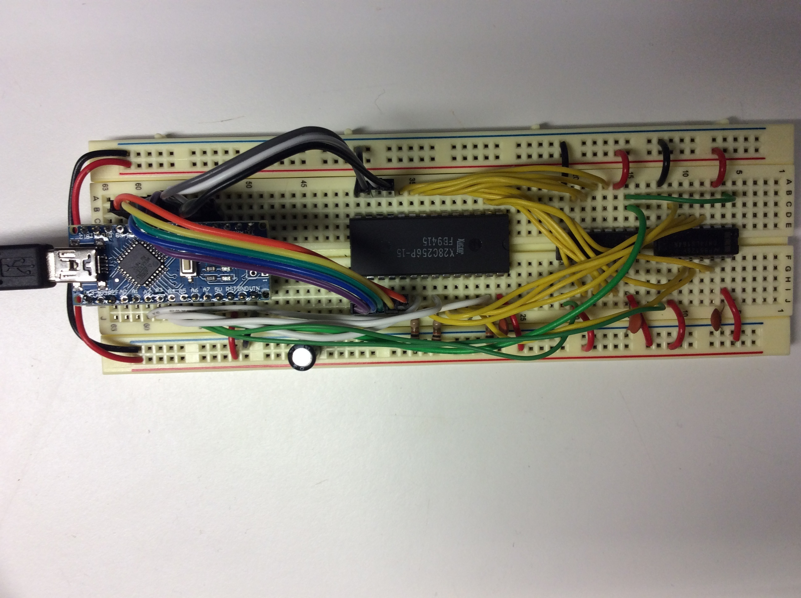

# TommyPROM - An Arduino-based EEPROM programmer

This is a simple EEPROM programmer and reader that can be assembled using an Arduino and a
few additional parts.  The original code was specific to the 28C256 32Kx8 EEPROM, but it
has been extended to also support Intel 8755A EPROMS and some 29C010 Flash.

Features include:
* Simple hardware design that can be assembled on a breadboard.
* ROM images transfers using XMODEM - no special host client needed.
* Support for fast block EEPROM writes - a 32K EEPROM will program in just a few seconds.
* Optimized code that supports the timing requirements needed to unlock the 28C series
Software Protection Algorithm.
* Modular software design to easily support other EEPROM and EPROM families.

See the [documentation pages](https://tomnisbet.github.io/TommyPROM/) for the full documentation
with hardware, software, and troubleshooting tips.

## Further Work

* [ ] Add a new PromDevice class for 27 series EPROMS.
* [x] Additional error checking in the CmdLine code.
