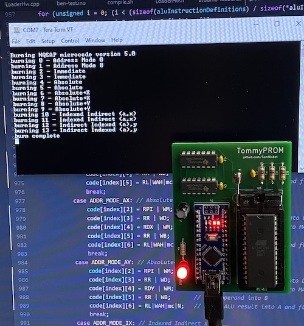

Although TommyPROM was originally designed as a one-off programmer to be used on a breadboard, there are now some PCB versions.  The original TommyPROM PCB for 28C256 chips is described here, and the [TommyPROM32 PCB](tommyprom32-pcb), for handling a variety of chips, has its own page.

## 28C256 PCB

A PCB version for the 28C256 and 28C64 chips was built to support a SAP-1 TTL breadboard
computer.  This project required a lot of burns for its  microcode and the PCB version
with the ZIF socket was much quicker than prying the chips out of a breadboard without
disturbing any of the wires.

The [KiCad design files](https://github.com/TomNisbet/TommyPROM/tree/master/schematics)
are in the project repo.

