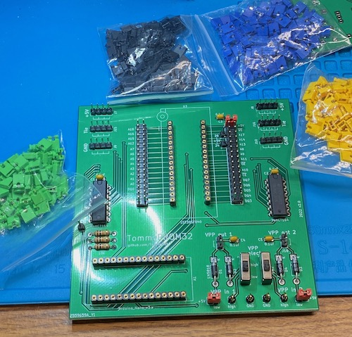
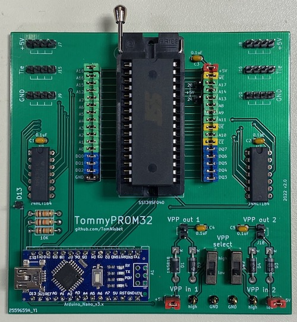
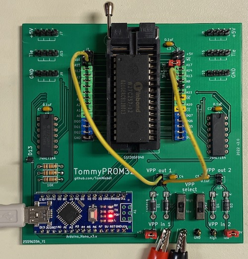
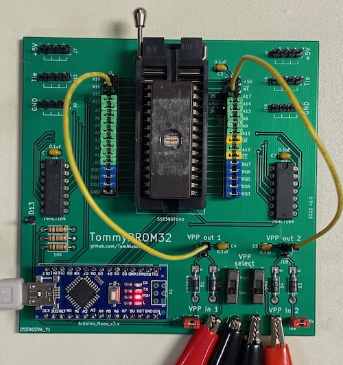
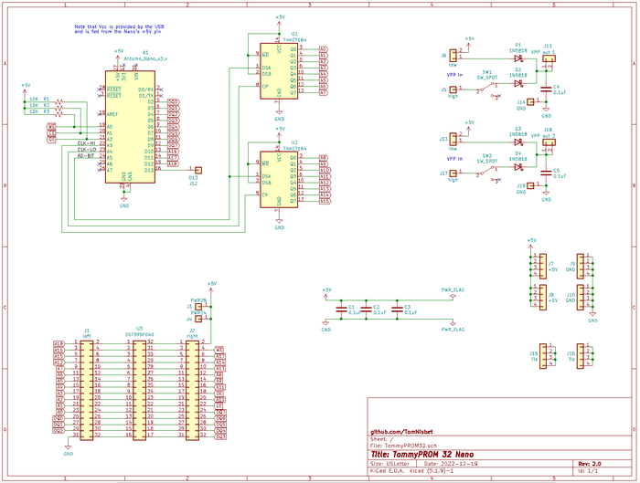

## TommyPROM32

The TommyPROM32 PCB supports 32-pin and smaller EEPROM and Flash chips. The board can be easily configured for many 32, 28, or 24 pin chips or used in its default setup for SST39SF devices.  The board has a set of headers that allow any of the signals to the target chip to be re-routed.

The default configuration and labels, with just jumper shunts (jumper caps) installed, is wired for the SST39SF0x0 chips.

Many other chips, particularly if they follow JEDEC standards, can be supported by removing shunts and adding just a few jumper wires.

If the board is only being used with 5V chips or used to read (but not program) other chips, then the Vpp switches, diodes, and other components on the lower right side of the board do not need to be installed.

There are power pins in place to support 28-pin and 24-pin chips with a shunt to the correct _VCC_ pin.  The photo below shows the 28C256 with a power jumper on pin 28, the _WE_ signal moved down to pin 27, and the _A14_ signal moved from pin 27 to pin 1.

## Vpp Power Selection Examples

Two power inputs and switches are provided to support older flash and EEPROM chips that need higher programming voltages.  Many of these chips just need a higher voltage, like 12V, applied to the VPP pin continuously during the programing and verification cycle.  In normal operation, the 5V _VCC_ signal is applied to the _VPP_ pin.  The board has VPP inputs for two voltages.  Applying 12V to _VPP In High_ and 5V to _VPP In Low_ lets the VPP output be switched between these two voltages using a manual slide switch for programming.

Note that some of the photos below show the initial version of the TommyPROM32 board that only contained a single switchable voltage.  The version 2.0 boards added a second switchable Vpp voltage section with multiple _VPP Output_ pins.  The _5V_ and _Vpp in low_ pins are now adjacent so that a wire is not needed for the common case where Vpp low is set to 5V.  There are also some general-purpose 5v, GND, and interconnect pins.

### W27C257 

The photo below shows the W27C257 set up for programming.  The _VPP in Low_ signal is connected to _VCC_ and the _VPP in High_ signal is using 12V from an external power supply. The _VPP Out_ signal is connected to the chip's VPP on pin 1.  The chip is in programming mode when the slide switch is set to the _High_ position and is in read mode when in the _Low_ position.

To erase the W27C257 chip, the external power supply is providing 14V and the _VPP Out_ is connected to the chip's _VPP_ and _A9_ pins.  

Note the the top picture showed the version 1.0 board and a jumper wire was needed to connect +5V to the _Vpp in low_ pin.  The newer board, shown below, has a jumper cap to make this connection, so no additional wire is needed.

### M27C256

The M27C256 chip needs two voltages for programming.  The external power supply is providing 12.75V to _VPP Out 1_ for the the chip's _Vpp_ and _A9_ pins.  The power supply is also providing 6.25V to _VPP Out 2_ for the chips _Vcc_.  Note the the chip's _Vcc_ is no longer connected to the system +5V.  The two _VPP Select_ switches should be in the _low_ position for normal read operation and in the _high_ position for programming.

## High Voltage Pulses

For chips that require a high voltage _Vpp_ pulse during programming, some external switching circuitry will be needed to allow the Arduino to control the VPP voltage.  There is a header connected to the unused _D13_ pin that can support this.  See the [Intel 8755 version of the hardware](hardware/#intel-8755a-hardware-version) for an example of voltage switching by TommyPROM.

## Schematics and Gerbers

The [TomyPROM32 KiCad design files](https://github.com/TomNisbet/TommyPROM/tree/master/schematics)
are in the project repo.

