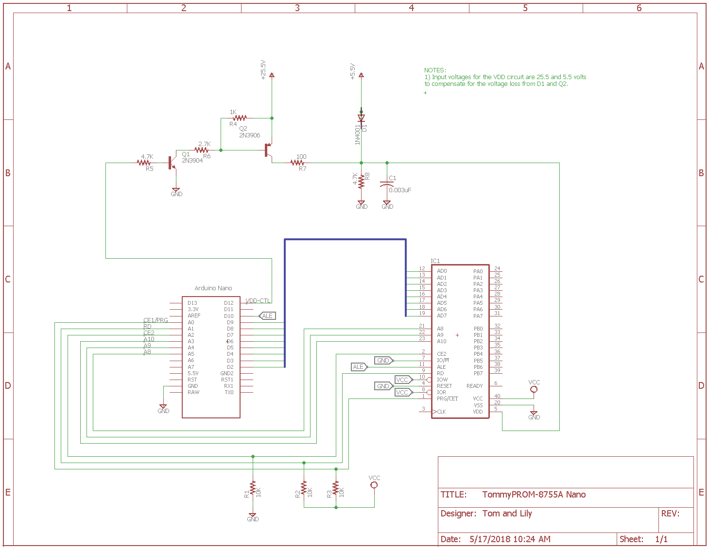

A special version of the TommyPROM hardware was developed to support the Intel 8755A EPROM with IO chip.  This is a 2Kx8 UV EPROM with additional I/O ports.  

The Intel 8355 is a mask programmable version of the 8755A.  This design can be used to read the 8355.

The Intel 8755A uses a multiplexed data and address bus, plus 3 additional address lines. Most Arduino hardware has enough pins to support this directly, so no shift register hardware is needed for addressing. An Arduino pin is also used to drive the ALE latch pin.

The 8755A requires the Vdd pin to be be switched between 5V and 25V during the programming of each byte. A simple transistor circuit is used for this. No voltage regulator circuit is present here for the programming voltage. Because this is designed as a quickly assembled hardware design, a triple output bench supply was used to provide the 25.5V, 5.5V and 5V outputs.

Eagle-format schematics can be downloaded from the [hardware project page](https://github.com/TomNisbet/TommyPROM/tree/master/hardware).
