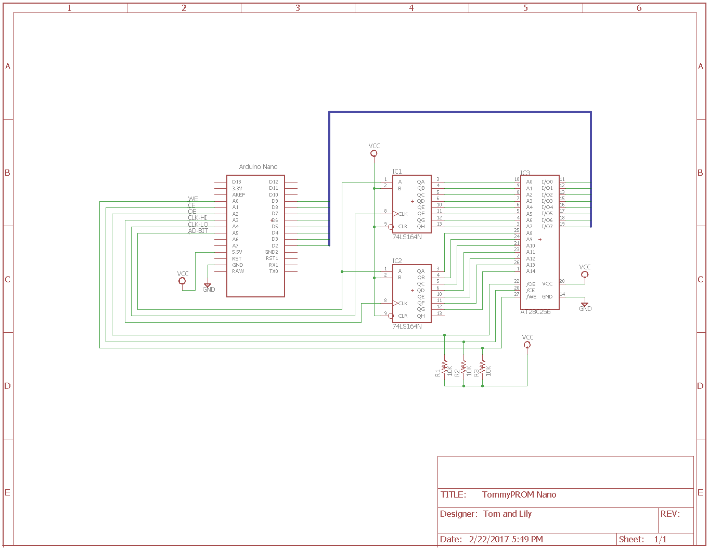

# Hardware Design

## Basic Hardware Version

The hardware uses an Arduino to write data and to toggle control lines with the
appropriate timing to access the PROM.  A pair of 74LS164 serial to parallel shift
registers latch the address lines.  Use of the shift registers allows the Arduino to
control up to 16 address lines using only 3 output ports. This design will read and
program the 28C series chips and can read most other parallel ROM chip families.

The basic circuit is as follows:
* Pins D2..D9 are wired to the data lines on the target PROM.
* Pins A0..A2 are wired to the WE, CE, and OE control lines on the target PROM.
* Pins A3..A5 control shift registers to produce the address lines.
* Pins D10..D12 control A16..A18 for chips larger than 64K bytes.

Note that the existing design uses 74LS164 shift registers, but another 8-bit parallel out
shift register, like the 74LS595, can be used instead with some pin changes.  See the
[74LS595 Shift Registers](#74ls595-shift-registers) section below for details.

The two shift registers can produce a sixteen bit address, although the 28C256 only needs
15 addresses. Chips larger than 64K are supported by using the shift registers for
A0..A15 and connecting Arduino pins D10..D12 to the chip's
A16..A18

## 74LS595 Shift Registers

When using the [74LS595](images/TommyPROM-595.jpg) instead of the 74LS164, there is
an additional output latch that is pulsed to put the contents of the shift register on the
output lines.  The code supports the 164s or the 595s by default.  No code changes are
needed to use either version of the shift register hardware.

The table below shows the connections when using either the 74LS164 or the 74LS595 for the
address shift registers.  USR refers to the Upper Shift Register
(A8..A15) and LSR refers to the Lower Shift Register
(A0..A7).

|Arduino             |74LS164     |74LS595|
|:---:               |:---:       |:---: |
|A0                  |ROM WE      |ROM WE|
|A1                  |ROM CE      |ROM CE|
|A2                  |ROM OE      |ROM OE|
|A3                  |USR CLK     |USR SRCLK|
|A4                  |LSR CLK     |LSR SRCLK|
|A51      |LSR+USR A   |LSR+USR SER|
|D2..D9              |ROM D0..D7  |ROM D0..D7  |
|D10..D122|ROM A16..A18|ROM A16..A18|
|D133     |--          |LSR+USR RCLK|

Notes:
1. The data pin on A5 is connected to both the Upper Shift Register (USR) and the Lower
Shift Register (LSR).
2. The upper address lines are not needed for 28C64 and 28C256 chips, but are used for
larger chips like the 27C040.
3. The D13 pin controls the output register on the '595 shift registers.  This pin is not
connected when using the 74LS164.

Note that the 74LS595s have two additional pins that need to be connected.  
* An output enable pin, labeled as either G or OE in the datasheet,  must be tied LOW for
both chips or else they will not produce any signal on their output lines.
* A reset pin, labeled as RESET or SRCLR, must be tied HIGH for both chips or else the
shift registers will be held in a reset state.

## Ben Eater EEPROM Programmer

If you are here because you built the [Ben Eater EEPROM
Programmer](https://github.com/beneater/eeprom-programmer), note that the designs are
similar, but the TommyPROM code will not run on that hardware without some significant
changes.  If you just need to unlock the Software Data Protection (SDP) on a chip, then
see the
[unlock-ben-eater-hardware sketch](https://github.com/TomNisbet/TommyPROM/tree/master/unlock-ben-eater-hardware)
for a solution.  That sketch is purpose-built to run on the Ben Eater hardware directly
and it **will not work** with the TommyPROM hardware.

If you want the functionality of the TommyPROM software on the Ben Eater hardware, the
easiest path is probably to modify the hardware to match the TommyPROM software rather
than trying to change the pin assignments in software.  There are a few reasons for this:

* The Ben Eater hardware uses D13 to control the ROM's Write Enable pin and it ties the
Chip Enable pin to always be active.  The D13 pin is connected to the Arduino's built-in
LED, which blinks at boot.  This means that the chip is likely writing some random data at
boot time.  This isn't a problem for the Ben Eater sketches, because they always write
their own data to the chip anyway.  One use of TommyPROM is to just read data from a chip,
so a random write on boot would be bad.
* The OE pin is controlled by the Address shift registers.  This doesn't work well with
the modular architecture of TommyPROM and it definitely would not work with 74LS164s
because it would toggle the OE pin as new addresses are shifted in.
* The direct port write software is a bit complicated and is more difficult to modify than
just renaming a few pin #defines.  This was done for performance reasons, particularly
for the SDP timing, but it means that the code is not easy to change.

Changing the hardware is fairly straightforward.  The data lines move 3 pins from D5..D12
down to D2..D9.  Most of the ROM and shift register control lines move over to the A0..A5
pins.  The upper shift register is controlled directly from the Arduino instead of being
connected to the overflow of the lower shift register.  All of the connections are in the
chart in the section above.

## Intel 8755A Hardware Version

The Intel 8755A uses a multiplexed data and address bus, plus 3 additional address lines.
Most Arduino hardware has enough pins to support this directly, so no additional hardware
is needed for addressing. An Arduino pin is also used to drive the ALE latch pin.

The 8755A requires the Vdd pin to be be switched between 5V and 25V during the programming
of each byte. A simple transistor circuit is used for this. No voltage regulator circuit
is present here for the programming voltage. Because this is designed as a quickly
assembled hardware design, a triple output bench supply was used to provide the 25.5V,
5.5V and 5V outputs.

Eagle-format schematics can be downloaded from the
[hardware project page](https://github.com/TomNisbet/TommyPROM/tree/master/hardware).
