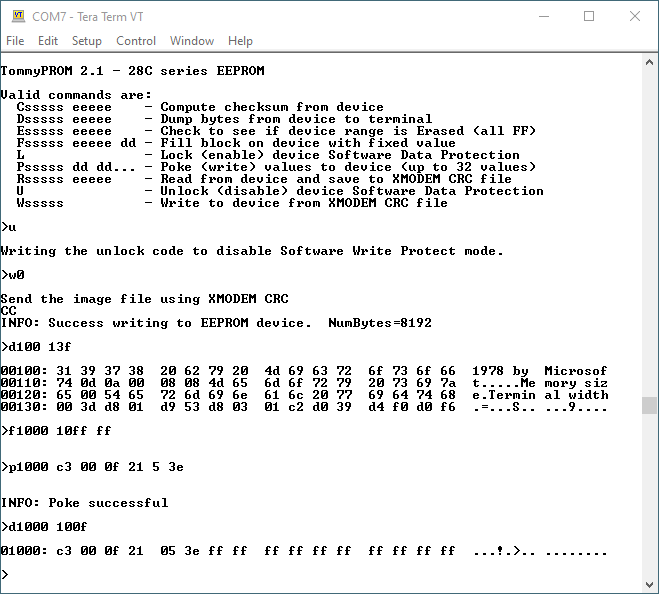

# TommyPROM - An Arduino-based EEPROM programmer

This is a simple EEPROM programmer and reader that can be assembled using an Arduino and a
few additional parts.  It has been successfully built using the Arduino UNO, Nano and
Boarduino models.

The original code was specific to the 28C256 32Kx8 EEPROM, but it has been extended to
also support SST39SF flash, 27C EPROMs, 29C flash and the Intel 8755A EPROMS.

Features include:
* Simple hardware design that can be assembled on a breadboard.
* ROM images transfers using XMODEM - no special host client needed.
* Support for fast block EEPROM writes - a 32K EEPROM will program in just a few seconds.
* Optimized code that supports the timing requirements needed to unlock the 28C series [Software Data Protection](28C256-notes) Algorithm.
* Modular software design to easily support other EEPROM, flash, and EPROM families.
* Hardware support for 19 address lines, allowing the use of chips as large as 512KB, like the SST39SF040 and 29C040.

## Design

The 28C hardware and software design can be used with other 5V PROMS as well.  Many 5V
chips, including UV EPROMs such as the 2716, 2764, 27C2001 and 27C040, can be read, but
not written, with the basic hardware. Some pin changes may be needed to get the signals to
the correct pins on the device.  See the [Extending the design](extending) page for
details on suggested hardware and software changes needed to support new
[EPROM, flash,and EEPROM families](prom-families).

The PROM-specific code is modular and can be easily adapted to support additional devices.
There are currently drivers for 28C series EEPROMS, SST39SF flash, 27C EPROMs and the
Intel 8755A EPROM.

Some 29C series chips, like the 29C010 can be written with the 28C hardware and driver.
The 29C series only differs from the 28C in that the 29C chips erase and write an entire
sector at a time.  The 29C010 and some 29C020 chips use a 128 byte sector, which matches
the XModem buffer in the current code.  Other 29C020s and all 29C040s use a 256 byte
sector and cannot be written without code changes to buffer up an entire 256 byte block of
data before writing.

The [hardware](hardware) page has descriptions of the hardware designs and links to
schematics.  The [software](software) page has class definitions and more information on
the software design.

The project was inspired by the
[MEEPROMMER programmer](https://github.com/mkeller0815/MEEPROMMER).

## PCB Version

Although it was originally designed as a one-off programmer to be used on a breadboard,
there are now some PCB versions as well.  The [PCB](pcb) page has descriptions with links
to the KiCad schematics and Gerber files.

## Compiling

Open the TommyPROM.ino file in the Arduino IDE. It should automatically open the cpp and h
files as well. The default code programs 28C series chips using Arduino Nano hardware.  To
use this version, just compile and upload it to the Arduino.

**Note well** that this code has been optimized for the Aduino UNO and Nano hardware so
*that it can run quickly enough to meet 28C series chip timing requirements for SDP
*unlocking.  To use different Arduino hardware, like the Micro, the board-specific code in
*PromDevice.cpp and PromAddressDriver.cpp must be changed to match the port mappings
*between the ATmega chip and the Arduino I/O pins.

Because the Arduino has limited code and RAM space available, only one PROM driver is
compiled in at a time.  To change drivers, uncomment the desired PROM_IS_xx line in
Configure.h and  comment out the other choices.  The code to instantiate the driver is
near the top in TommyPROM.ino.  The change to Configure.h will automatically cause a
driver to be installed, but it may be necessary to modify the parameters for a specific
chip type.

## Operation

To use the programmer, connect the Arduino USB to the host computer and run a terminal
program, such as TeraTerm (Windows) or Minicom (Linux).  The Arduino development Serial
Monitor can also be used as a terminal initially, but it does not support XMODEM
transfers, so the READ and WRITE commands can't be used.

Disable both hardware and software flow control in the minicom settings for best results.

Set the terminal's serial parameters to 115200 baud, 8 bits, no parity, 1 stop bit to
match the Arduino.  Press the Enter key.  If the connection is successful, TommyPROM will
display a menu of options.

Most of the commands take a start address parameter, always entered as 1 to 5 hex
characters.  Leading zeros are not required. If needed, the end address parameter is also
in hex.  Parameters are separated by a space. For example, either of the commands:

    d0000 01ff
    d0 1ff

will dump memory from 0000H to 01ffH.  Note that commands and parameters can be entered in
uppercase or lowercase.

The R command is used to read from a PROM and save a binary image on the host.  The W
command receives a file from the host and writes (burns) it into the device.  The R
command needs a start and end address.  The W command determines the end address from the
received file size.

Once the READ or WRITE command is issued to the programmer, the transfer must
be started on the host program.

Note that previous versions of TommyPROM used the XMODEM-CRC protocol to complete the file
transfers for the READ and WRITE commands.  This did not work well with minicom and other
Linux programs that rely on the sz/rz commands.  Versions 2.5 and later of TommyPROM now
use basic XModem with the 8-bit checksum.  The XModem-CRC support is still available as a
compile-time option.  See [issue #19](https://github.com/TomNisbet/TommyPROM/issues/19)
for details.

The files used for READ and WRITE are simple binary images. This can be created directly
by [asm85](http://github.com/TomNisbet/asm85) or can be converted from S-record or Intel
HEX using an external utility.

## Troubleshooting

* Verify that the Arduino type you are using is a supported board or that its I/O port definitions match one of the supported boards.  Some other Arduino boards, like the
Duemilanove, appear to be compatible but have not been tested. Others, like the Micro,
have different port mappings and definitely will not work without software changes.
* If the code doesn't appear to be working, concentrate on the read operations first to
verify that the data and address paths are good.
* 28C series EEPROMS, like the X28C256, sometimes ship from the factory with Data
Protection enabled.  Use the UNLOCK command to disable this. See the
[28C256 Notes](28C256-notes) for more information.
* Re-check all hardware connections and verify the the control pins are going to the
Arduino pins that match the definitions in the code.
* This repo contains a standalone program called HardwareVerify that allows low-level
access to the address, data, and control lines through a menu-driven interface.  See the [troubleshooting](troubleshooting) section for more tips.
