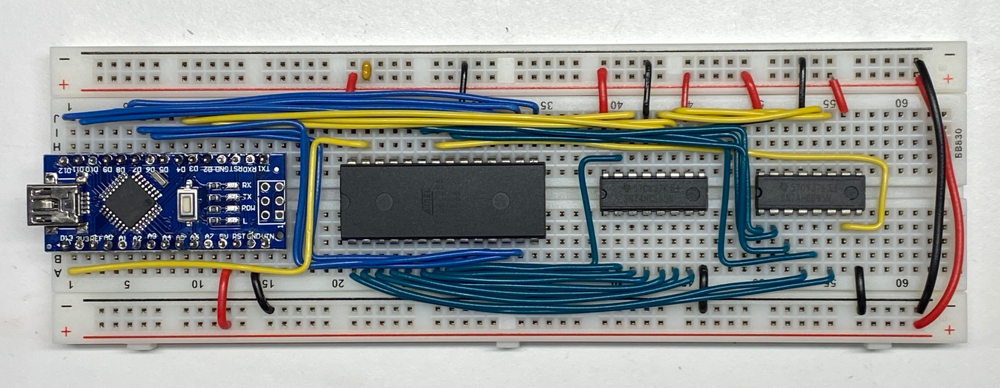

# Unlock Ben Eater Hardware

Utility to unlock 28C256 Software Data Protection (SDP) for the
[Ben Eater EEPROM](https://github.com/beneater/eeprom-programmer)
programmer design.  This hardware is similar to the TommyPROM hardware, but it uses
different shift register chips and different pin assignments.

To meet the timing requirements of the SDP unlock, this code uses direct port writes
to set and read values on the data bus.  It will work with Arduino Uno and Nano hardware,
but would require changes for other platforms.

**NOTE** that this sketch **will not** work on TommyPROM hardware.  It is included here
to help people using that hardware to unlock their chips.
